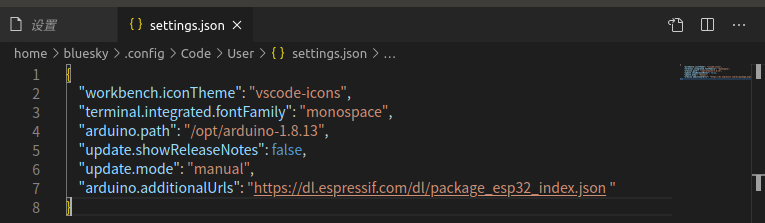
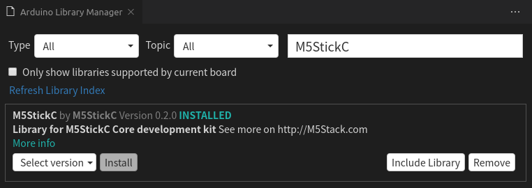
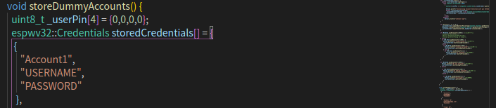

# Password Manager
## 基于M5StickC的密码管理器

## 开发环境
- Visual Studio Code
-  插件(必要)
    - C/C++
    - Arduino
  
## 原作者已实现功能
* [x] BLE connection requires passcode 蓝牙连接需要密码
* [x] Secure BLE connection 蓝牙安全连接
* [x] Send username and password on button push 一键发送用户名和密码
* [x] Store credentials securely on the device 将凭证安全存储在设备上

## 修改及实现功能
* [x] Fix the problem that disconnected cannot be used 修复断开连接无法使用的问题  
* [x] Modified the sending button logic 修改了发送的按键逻辑
* [x] Customize some accounts that only send passwords, don't switch every time 可以自定义部分账号只发送密码,不要每次都切换
* [x] Fix the problem of returning from account 00 to the previous page 修复从账户00返回上一页的问题
* [x] Add Chinese comment 增加中文注释  
  

## 待添加功能  
* [ ] 长时间不使用显示时间

## 参考
- https://github.com/Joengenduvel/espwv32
- https://m5stack.com/products/stick-c
- https://docs.m5stack.com/#/en/arduino/arduino_api

## 教程
- 修改settings.json文件，添加代码  
`arduino.additionalUrls": "https://dl.espressif.com/dl/package_esp32_index.json`
  

- 打开Arduino Boards Manager，输入esp32并安装
  

- 打开Board Configuration选择M5Stick-C
    

- 打开Manage Libraries，输入M5StickC并安装  
  

- 修改编辑账号  
  
`_userPin[4] = {0,0,0,0}`用于设置初始密码  
`   {
      "Account1",
      "USERNAME",
      "PASSWORD"
    }`用于设置账户名称，账户名，密码

- 编译并上传  
  
  

  